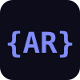
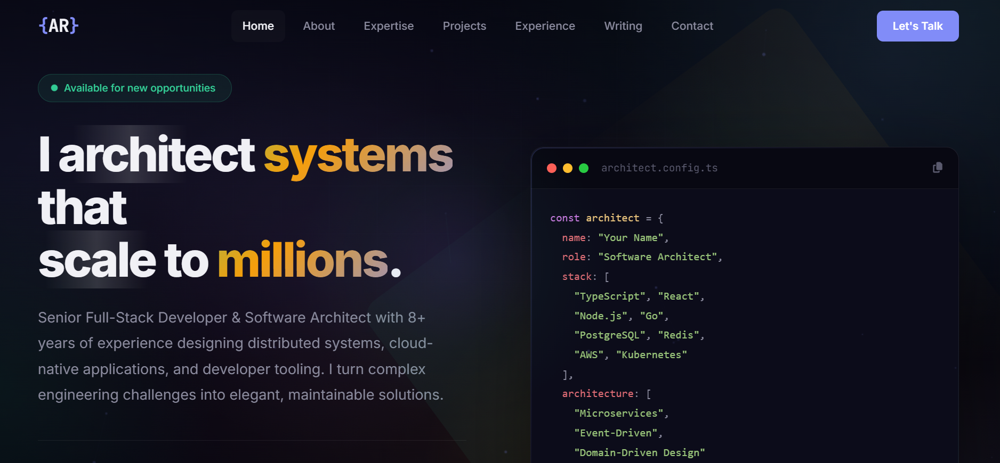
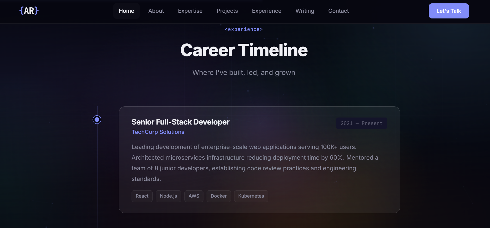
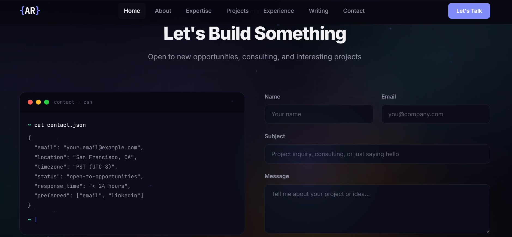

<p align="center">
  
</p>

<h1 align="center">Developer Portfolio</h1>

<p align="center">
  <strong>A stunning, performance-optimized developer portfolio template</strong><br>
  Pure HTML, CSS & JavaScript — no frameworks, no dependencies, no build tools.
</p>

<p align="center">
  <a href="#-features">Features</a> •
  <a href="#-quick-start">Quick Start</a> •
  <a href="#-customization">Customization</a> •
  <a href="#-performance">Performance</a> •
  <a href="#-license">License</a>
</p>

<p align="center">
  
  
  
  
  
</p>

---

## Preview

<p align="center">
  
</p>

<p align="center">
  
</p>

<p align="center">
  
</p>

### Sections

| Section | Description |
|---------|-------------|
| **Hero** | Typewriter intro, animated code window, live stats |
| **About** | Bio cards with glass morphism effect |
| **Expertise** | Tech stack grid organized by domain |
| **Projects** | Skeleton-style project showcases with hover effects |
| **Experience** | Interactive timeline with role details |
| **Writing** | Blog/article cards |
| **Testimonials** | Peer review quotes |
| **Contact** | Working contact form + social links |

---

## ✨ Features

### Visual Effects
- Aurora gradient background with constellation canvas
- Morphing gradient orbs with smooth float animations
- Scroll-triggered reveal animations
- Holographic cards with animated borders
- Magnetic buttons with tilt effect
- Typewriter text animation
- Wave section dividers

### Performance
- **Zero dependencies** — pure vanilla HTML/CSS/JS
- **Single rAF loop** — all animations unified into one render cycle
- GPU-accelerated `translate3d` transforms throughout
- CSS `contain: strict` isolation on all fixed layers
- `content-visibility: auto` for off-screen sections
- Background animations pause during scroll
- Firefox-specific optimizations (auto-detected)
- Constellation canvas renders at 30fps with spatial culling
- **~760 lines of HTML** · **~2400 lines of CSS** · **~460 lines of JS**

### Responsive Design
- Fluid layouts from 320px to 4K
- Touch-optimized for mobile (no hover-dependent features)
- Collapsible mobile navigation
- Adaptive typography and spacing

### Developer Experience
- Clean, well-commented code
- CSS custom properties for easy theming
- Semantic HTML with proper ARIA labels
- No build step — edit and deploy

---

## 🚀 Quick Start

### Option 1: Clone & Open

```bash
git clone https://github.com/byte-way/developer-portfolio.git
cd developer-portfolio
```

Open `index.html` in your browser. That's it.

### Option 2: Use as Template

Click the **"Use this template"** button at the top of this repo to create your own copy.

### Option 3: Download

Download the ZIP from the green **Code** button and extract it.

---

## 🎨 Customization

### 1. Personal Info

Edit `index.html` and replace the placeholder content:

```
Your Name        → your actual name
your.email@...   → your email
linkedin/example → your LinkedIn URL
github/example   → your GitHub URL
```

### 2. Colors

All colors are defined as CSS custom properties in `css/style.css`:

```css
:root {
    --bg-primary: #060610;        /* Main background */
    --accent: #818cf8;            /* Primary accent (indigo) */
    --accent-secondary: #34d399;  /* Secondary accent (green) */
    --accent-warm: #f59e0b;       /* Warm accent (amber) */
}
```

### 3. Fonts

The template uses [Inter](https://fonts.google.com/specimen/Inter) for body text and [JetBrains Mono](https://fonts.google.com/specimen/JetBrains+Mono) for code. Change them in the Google Fonts `<link>` tag in `index.html`.

### 4. Sections

Each section is a self-contained `<section>` block. Remove, reorder, or duplicate as needed:

```
#home        → Hero with intro
#about       → About cards
#expertise   → Tech stack
#projects    → Project showcases
#experience  → Career timeline
#writing     → Blog articles
#contact     → Contact form
```

### 5. Projects

Project cards use a skeleton style. Edit the project blocks in `index.html`:

```html
<article class="project-showcase reveal">
    <div class="project-showcase-visual">
        <div class="project-showcase-skeleton">
            <i class="fas fa-your-icon"></i>
        </div>
    </div>
    <div class="project-showcase-content">
        <h3 class="project-showcase-title">Your Project</h3>
        <p class="project-showcase-description">Description here.</p>
    </div>
</article>
```

---

## ⚡ Performance

Lighthouse scores on a clean deployment:

| Metric | Score |
|--------|-------|
| Performance | 95+ |
| Accessibility | 90+ |
| Best Practices | 95+ |
| SEO | 90+ |

Key optimizations:
- No render-blocking JS (script at bottom of `<body>`)
- Single event listener for mousemove, single listener for scroll
- All CSS animations use compositor-only properties (`transform`, `opacity`)
- `IntersectionObserver` for lazy reveals (no scroll position polling)
- Firefox detected at runtime → heavy effects disabled automatically

---

## 📁 Project Structure

```
developer-portfolio/
├── index.html        # Main page (all sections)
├── css/
│   └── style.css     # Complete design system (~2400 lines)
├── js/
│   └── script.js     # Interactions & animations (~460 lines)
├── screenshots/      # README preview images
│   ├── hero.png
│   ├── experience.png
│   └── contact.png
├── favicon.svg       # Browser tab icon {AR}
├── .gitignore        # Git ignore rules
├── LICENSE           # MIT License
└── README.md         # This file
```

---

## 🌐 Deployment

### GitHub Pages (free)

1. Push this repo to GitHub
2. Go to **Settings → Pages**
3. Set source to **main branch** / root
4. Your site is live at `https://byte-way.github.io/developer-portfolio/`

### Netlify / Vercel

Connect your repo — zero config needed. No build command required.

### Any Static Host

Upload `index.html`, `css/`, `js/`, and `favicon.svg` to any web server.

---

## 🤝 Contributing

Contributions are welcome! Feel free to:

1. Fork the repo
2. Create a feature branch (`git checkout -b feature/amazing-feature`)
3. Commit your changes (`git commit -m 'Add amazing feature'`)
4. Push to the branch (`git push origin feature/amazing-feature`)
5. Open a Pull Request

---

## 📄 License

This project is licensed under the **MIT License** — see the [LICENSE](LICENSE) file for details.

Free for personal and commercial use. Attribution appreciated but not required.

---

<p align="center">
  If this template helped you, consider giving it a ⭐
</p>
# Portfolio Template 2 - Gradient Theme

## 🎨 Theme Description
A modern portfolio with beautiful gradient backgrounds, smooth transitions, and contemporary design elements.

## 📁 File Structure
```
Portfolio-2/
├── index.html          # Main HTML file
├── css/
│   └── style.css       # Stylesheet
├── js/
│   └── script.js       # JavaScript file
└── favicon.svg         # Website icon
```

## 🚀 Quick Start
1. Open `index.html` in your browser to preview
2. Edit `index.html` to update your personal information
3. Modify `css/style.css` to change colors and styling

## ✨ Features
- Beautiful gradient backgrounds
- Smooth scroll animations
- Modern card designs
- Responsive layout
- Clean typography
- Interactive hover effects

## 📝 Customization Guide
See the main `USER_GUIDE.md` in the root folder for detailed customization instructions.

---
**Portfolio Template 2** | Gradient Theme
